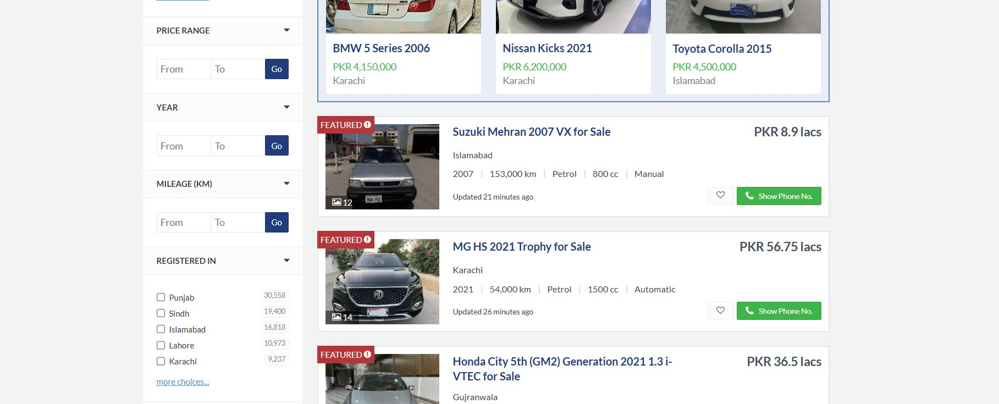
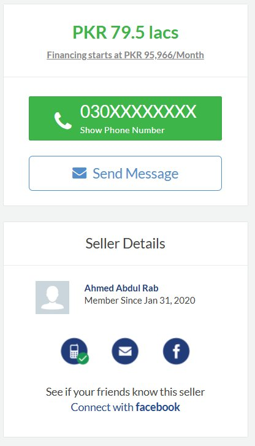
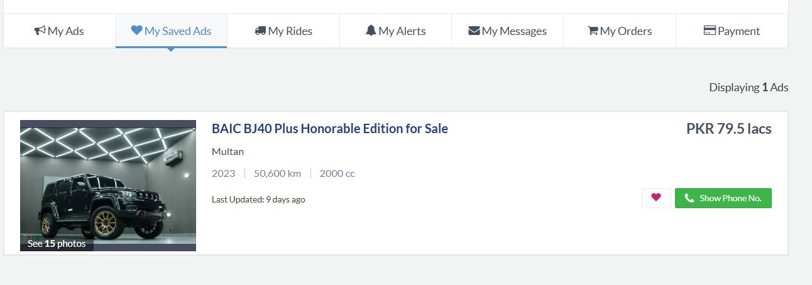

# PakWheels Car Marketplace — Assignment 02

**Subject:** Object Oriented Programming (CS1004)  
**Instructor:** Talha Shahid  
**University:** FAST-NUCES Karachi | Spring 2026

---

## What This Is

This project is a console-based Car Marketplace system inspired by PakWheels.com. It extends Assignment 01 by adding Inheritance, Polymorphism, Abstraction, Operator Overloading, and Friend Functions to the existing design.

---

## How to Compile and Run

```bash
g++ -std=c++17 -o marketplace main.cpp User.cpp Message.cpp Engine.cpp Vehicle.cpp Car.cpp Bike.cpp Listing.cpp Seller.cpp Buyer.cpp Admin.cpp Marketplace.cpp Favorite.cpp

./marketplace
```

---

## File Structure

```
A2/
├── screenshots/                  # PakWheels website screenshots
├── IListable.h                   # Abstract: display behavior
├── ISearchable.h                 # Abstract: search behavior
├── IMessagable.h                 # Abstract: messaging behavior
├── IApprovable.h                 # Abstract: approval behavior
├── User.h / User.cpp             # Base class for all users
├── Seller.h / Seller.cpp         # Inherits User
├── Buyer.h / Buyer.cpp           # Inherits User
├── Admin.h / Admin.cpp           # Inherits User
├── Engine.h / Engine.cpp         # Composed inside Vehicle
├── Vehicle.h / Vehicle.cpp       # Abstract base for Car and Bike
├── Car.h / Car.cpp               # Inherits Vehicle
├── Bike.h / Bike.cpp             # Inherits Vehicle
├── Listing.h / Listing.cpp       # Implements IApprovable
├── Favorite.h / Favorite.cpp     # Aggregation with Vehicle
├── Message.h / Message.cpp       # Messaging with friend function
├── Marketplace.h / Marketplace.cpp
└── main.cpp
```

---

## Website Reference — PakWheels.com

The features below were taken from PakWheels and replicated in code.

---

### 1. Search by Make / Model / Price Range

PakWheels homepage has a search bar where users type a car make or model and optionally select a price range before searching.


**What I replicated:**

```cpp
// Marketplace.cpp
void Marketplace::searchByBrand(string brand) const
{
    for (int i = 0; i < totalListings; i++)
    {
        if (listings[i].getVehicle()->getBrand() == brand && listings[i].isApproved())
            listings[i].displayListing();
    }
}

void Marketplace::searchByModel(string model) const
{
    for (int i = 0; i < totalListings; i++)
    {
        if (listings[i].getVehicle()->getModel() == model && listings[i].isApproved())
            listings[i].displayListing();
    }
}
```

**Why:** PakWheels lets users search by make and model from the homepage. I implemented the same in `Marketplace` — a buyer can search approved listings by brand (e.g. Toyota) or model (e.g. Yaris) and only matching results are shown.

---

### 2. Filter by Price Range, Year and Mileage

On the search results page, PakWheels shows a sidebar with Price Range, Year, and Mileage (KM) filters — all with From/To inputs.



**What I replicated:**

```cpp
// Marketplace.cpp
void Marketplace::filterByPrice(float minPrice, float maxPrice) const
{
    for (int i = 0; i < totalListings; i++)
    {
        if (listings[i].isApproved())
        {
            float p = listings[i].getVehicle()->getPrice();
            if (p >= minPrice && p <= maxPrice)
                listings[i].displayListing();
        }
    }
}

void Marketplace::filterByYear(int minYear) const
{
    for (int i = 0; i < totalListings; i++)
    {
        if (listings[i].isApproved() &&
            listings[i].getVehicle()->getYear() >= minYear)
            listings[i].displayListing();
    }
}

void Marketplace::filterByMileage(int maxMileage) const
{
    for (int i = 0; i < totalListings; i++)
    {
        if (listings[i].isApproved() &&
            listings[i].getVehicle()->getMileage() <= maxMileage)
            listings[i].displayListing();
    }
}
```

**Why:** The sidebar on PakWheels is the main way buyers narrow down results. I replicated all three filters — price range (min/max), minimum year, and maximum mileage — as separate functions in `Marketplace`. Each one loops through approved listings and only shows results that match the condition.

`matchesSearch(float min, float max)` is also overloaded in `Car` specifically for price-based search, which demonstrates function overloading:

```cpp
// Car.cpp
bool Car::matchesSearch(float minPrice, float maxPrice) const
{
    return (price >= minPrice && price <= maxPrice);
}
```

---

### 3. Send Message to Seller

On any car listing page, PakWheels shows a "Send Message" button along with the seller's name and contact details under "Seller Details".



**What I replicated:**

```cpp
// Buyer.cpp
void Buyer::sendMessage(string receiver, string text)
{
    Message m(name, receiver, text);
    m.displayMessage();
    logMessage(m);  // friend function logs the message
}

// Seller.cpp
void Seller::sendMessage(string receiver, string text)
{
    Message m(name, receiver, text);
    m.displayMessage();
}
```

Both `Buyer` and `Seller` implement the `IMessagable` interface which forces both to provide `sendMessage()`. The `Message` class keeps sender, receiver, and text private. `logMessage()` is a friend function that reads those private fields directly for logging without making them public:

```cpp
// Message.cpp
void logMessage(const Message &m)
{
    cout << "[LOG] From: " << m.sender << " To: " << m.receiver
         << " | Text: " << m.text << endl;
}
```

The seller's contact info (phone, email) is private in `User`. The friend function `printUserInfo()` accesses it directly — similar to how PakWheels shows seller contact only on the listing page:

```cpp
// User.cpp
void printUserInfo(const User &u)
{
    cout << "Name: " << u.name << " | Phone: " << u.phone
         << " | Email: " << u.email << endl;
}
```

**Why:** PakWheels allows two-way communication between buyer and seller. I modelled this with a `Message` class and gave both Buyer and Seller the ability to send messages through the shared `IMessagable` interface.

---

### 4. Save to Favourites (My Saved Ads)

PakWheels has a "My Saved Ads" section in the account area where listings saved by the buyer appear with a heart icon.



**What I replicated:**

```cpp
// Buyer.cpp
void Buyer::saveFavorite(Vehicle *v)
{
    if (favCount < 10)
        favorites[favCount++].addFavorite(v);
}

void Buyer::viewFavorites() const
{
    for (int i = 0; i < favCount; i++)
        favorites[i].showFavorite();
}
```

```cpp
// Favorite.cpp
void Favorite::showFavorite() const
{
    if (vehicle != nullptr)
        vehicle->displayDetails();  // polymorphic — works for Car and Bike
}
```

**Why:** PakWheels lets buyers save listings they are interested in and view them later. I implemented this through a `Favorite` class that stores a pointer to a `Vehicle` (aggregation — the vehicle exists independently of the favourite). The `Buyer` holds an array of 10 `Favorite` objects. When `viewFavorites()` is called, each one calls `displayDetails()` on its vehicle — which works polymorphically for both `Car` and `Bike`.

---

## OOP Concepts Summary

### Inheritance (5 Relationships)

| Derived | Base | Reason |
|---|---|---|
| Seller | User | Seller is a user with a shop and listings |
| Buyer | User | Buyer is a user with favorites and a budget |
| Admin | User | Admin is a user with approval authority |
| Car | Vehicle | Car is a vehicle with doors and transmission |
| Bike | Vehicle | Bike is a vehicle with type and gears |

### Abstraction (4 Abstract Classes)

| Interface | Pure Virtual | Used By |
|---|---|---|
| IListable | displayDetails() | Vehicle → Car, Bike |
| ISearchable | matchesSearch() | Vehicle → Car, Bike |
| IMessagable | sendMessage() | Buyer, Seller |
| IApprovable | approve(), reject(), isApproved() | Listing |

### Polymorphism

- **Overriding:** `displayDetails()` in Car and Bike behave differently when called through a `Vehicle*` pointer
- **Overloading:** `matchesSearch()` in Car has two versions — one takes a keyword string, one takes a price range

### Operator Overloading

| Operator | Class | Purpose |
|---|---|---|
| == | Vehicle | Checks if two vehicles are the same (brand + model + price) |
| + | Vehicle | Returns combined mileage of two vehicles |
| == | Listing | Checks if two listings point to the same vehicle ID |

### Friend Functions

| Function | Class | Why needed |
|---|---|---|
| printUserInfo() | User | Access private phone/email for seller contact display |
| logMessage() | Message | Access private sender/receiver/text for admin logging |
| compareVehicles() | Vehicle | Compare brand/model/year without adding extra getters |
| auditListing() | Listing | Read approved/rejected state together for admin audit |

### Static Members

- `Admin::approvedCount` — tracks total approvals across all admin objects
- `Admin::rejectedCount` — tracks total rejections system-wide
- `Marketplace::systemListings` — total listings ever added to marketplace
- `Listing::totalCreated` — total listing objects ever created

These are static because the data belongs to the class as a whole, not to any single object.
